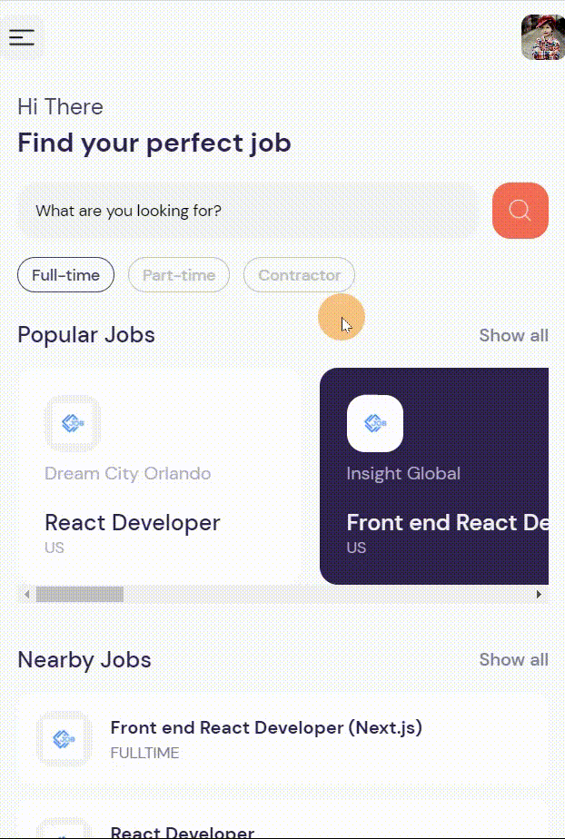
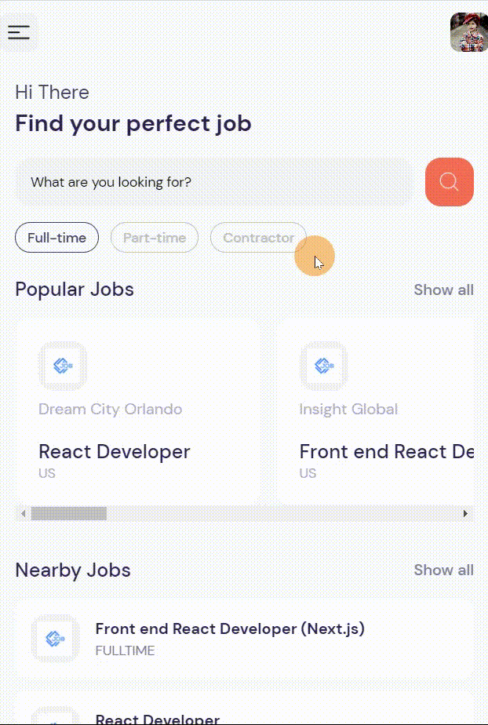

# Job Searching App

  

This is a project that helps find a job of your dream. This project uses JSearch API provided by Rapid API. This project is based on the JS Mastery tutorial of building job searching app, which was written in javascript. 

In this branch you'll find:

-   **Typescript** language.
-   **Expo Router** framework built on top of **React Native**.
-   **Prettier** plugin for one code theme.
-   **[JSearch API](https://rapidapi.com/letscrape-6bRBa3QguO5/api/jsearch/details)** as the source of information about available jobs.

## Screenshots

Scrolling the main page and viewing a project description:

  

Searching for the desired job:

  

